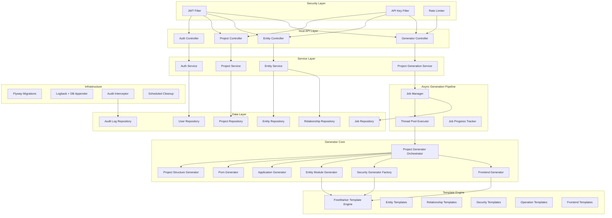
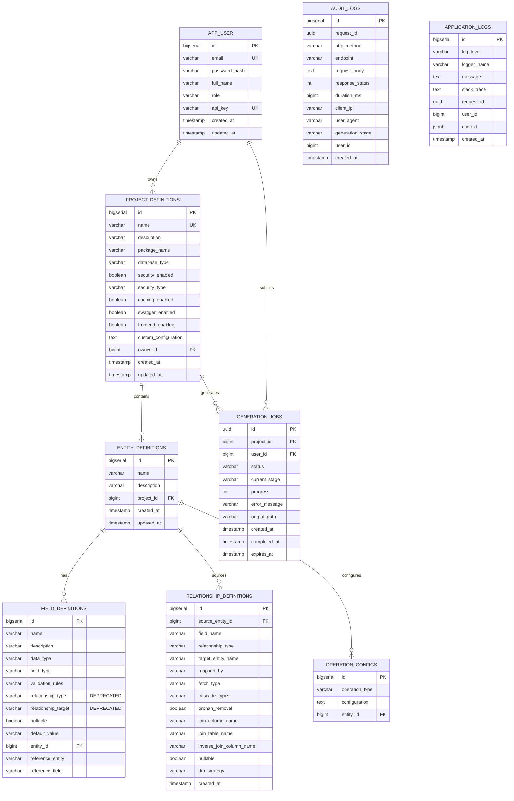
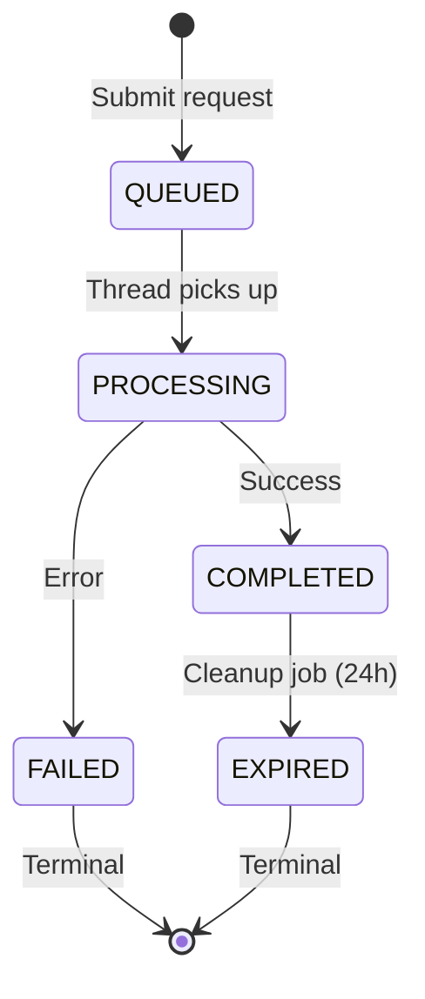

# Design Document: Production Implementation

## Overview

This design transforms the Dynamic Backend Generator from a prototype into a production-ready Spring Boot Low-Code Engine. The Generator accepts project and entity definitions via REST API and produces complete, compilable Spring Boot applications as downloadable ZIP files.

The production implementation spans 11 phases addressing: codebase hygiene, database migration management, multi-environment configuration, structured error handling, audit logging, host API security, security code generation for output projects, API standards, relationship modeling and code generation, DTO strategies, operation completeness, asynchronous generation, test coverage, documentation, containerization, and frontend generation.

**Key Design Decisions:**
- **Flyway for schema management** — versioned migrations replace Hibernate auto-DDL in production, ensuring repeatable deployments
- **Async generation with job tracking** — long-running generation moves to a thread pool with polling-based status updates
- **Dedicated relationship model** — relationships decouple from field definitions into their own table with rich configuration
- **Strategy-based DTO generation** — four strategies (ID_ONLY, SUMMARY, NESTED, IGNORE) prevent circular references while giving users control
- **Layered security** — JWT + API key authentication on the host API; pluggable security generators for output projects
- **Profile-driven configuration** — dev/prod/docker profiles with externalized environment variables

## Architecture



### Package Structure (Target)

```
com.user.driven.operations
├── app
│   ├── api
│   │   ├── controller/          # REST controllers (versioned under /api/v1/)
│   │   ├── dto/                 # Request/Response DTOs and envelope
│   │   └── mapper/              # Entity-DTO mappers
│   ├── common
│   │   ├── exception/           # Exception hierarchy + GlobalExceptionHandler
│   │   ├── logging/             # DatabaseAppender, AuditInterceptor, MDC filter
│   │   └── util/                # Constants, FileUtils, ZipUtil
│   ├── config/                  # Security, Swagger, Async, AppProperties
│   ├── core
│   │   ├── model/               # JPA entities (ProjectDefinition, EntityDefinition, etc.)
│   │   ├── repository/          # Spring Data JPA repositories
│   │   └── service/             # Service interfaces and implementations
│   └── security/                # JWT, API key filters, UserDetails, rate limiting
├── generator
│   ├── core/                    # BaseGenerator, TemplateEngine, FileWriterService
│   ├── module/                  # EntityModuleGenerator, OperationGenerators
│   ├── orchestrator/            # ProjectGenerator (orchestration)
│   ├── project/                 # PomGenerator, ApplicationGenerator, StructureGenerator
│   ├── relationship/            # RelationshipCodeGenerator, DtoStrategyGenerators
│   ├── security/                # SecurityGenerator implementations (JWT, Basic, OAuth2, Session)
│   ├── frontend/                # FrontendGenerator, React template processors
│   └── utils/                   # NamingUtils, RelationshipGeneratorUtil
└── enums/                       # All enumerations
```

## Components and Interfaces

### 1. Configuration Components

```java
@ConfigurationProperties(prefix = "app")
public class AppProperties {
    private String generatedProjectsDirectory = "./generated-projects";
    private String mavenExecutable = "mvn";
    private int asyncPoolSize = 5;
    private int jobRetentionHours = 24;
    private int auditRetentionDays = 30;
}
```

**Profile Configuration:**

| Property | dev | prod | docker |
|----------|-----|------|--------|
| Database | H2 in-memory | PostgreSQL | PostgreSQL (service: db) |
| ddl-auto | create-drop | validate | validate |
| Flyway | disabled | enabled | enabled |
| Port | 8083 | 8080 | 8080 |
| Logging | console (DEBUG) | JSON (INFO) + rolling-file + DB | JSON (INFO) + rolling-file + DB |

### 2. Exception Hierarchy

```java
public abstract class BaseApplicationException extends RuntimeException {
    private final String resourceType;
    private final Object resourceIdentifier;
    private final String operationStage;
}

public class ProjectNotFoundException extends BaseApplicationException { }
public class DuplicateNameException extends BaseApplicationException { }
public class GenerationFailedException extends BaseApplicationException { }
public class ValidationException extends BaseApplicationException { }
public class BuildVerificationException extends BaseApplicationException { }
public class UnsupportedSecurityTypeException extends BaseApplicationException { }
```

**ErrorResponse:**
```java
public record ErrorResponse(
    LocalDateTime timestamp,
    int status,
    String errorType,
    String message,
    String path,
    String requestId,
    List<FieldError> fieldErrors  // only for validation exceptions
) {}
```

### 3. Security Components

```java
public interface JwtService {
    String generateAccessToken(AppUser user);     // 15 min expiry
    String generateRefreshToken(AppUser user);    // 7 day expiry
    Claims validateToken(String token);
}

public class JwtAuthenticationFilter extends OncePerRequestFilter { }
public class ApiKeyAuthenticationFilter extends OncePerRequestFilter { }
public class RateLimitFilter extends OncePerRequestFilter { }  // 10 req/min on generation
```

**SecurityFilterChain order:** RateLimit → ApiKey → JWT → Authorization

**Public endpoints:** `/api/v1/auth/**`, `/swagger-ui/**`, `/api-docs/**`, `/actuator/health`

### 4. Audit Components

```java
public class RequestIdFilter extends OncePerRequestFilter {
    // Generates X-Request-Id UUID, sets MDC, adds to response header
}

@Component
public class AuditInterceptor implements HandlerInterceptor {
    // preHandle: create Audit_Log with request metadata
    // afterCompletion: update duration, response status
}

public class DatabaseAppender extends AppenderBase<ILoggingEvent> {
    // Persists ERROR/WARN logs to application_logs table
}
```

### 5. Async Generation Pipeline

```java
public interface GenerationJobService {
    GenerationJob submit(Long projectId, Long userId);
    GenerationJob getStatus(UUID jobId);
    Resource download(UUID jobId);
}

public class AsyncGenerationExecutor {
    @Async("generationTaskExecutor")
    public void executeGeneration(GenerationJob job, ProjectDefinition project) {
        // Pipeline: VALIDATION(10%) → STRUCTURE(30%) → ENTITIES(50%)
        //           → SECURITY(70%) → BUILD(90%) → ZIP(100%)
    }
}
```

### 6. Generator Components

**Relationship Code Generator:**
```java
public interface RelationshipCodeGenerator {
    String generateAnnotations(RelationshipDefinition rel, boolean isBidirectional);
    String generateImports(List<RelationshipDefinition> rels);
    String generateField(RelationshipDefinition rel);
}
```

**DTO Strategy Generator:**
```java
public interface DtoStrategyGenerator {
    String generateDtoField(RelationshipDefinition rel, EntityDefinition target);
    Optional<String> generateSummaryDto(EntityDefinition target);
}

// Implementations: IdOnlyStrategy, SummaryStrategy, NestedStrategy, IgnoreStrategy
```

**Operation Template Registry:**
```java
@Component
public class OperationTemplateRegistry {
    // Maps OperationType → template path + model builder
    // Handles: PAGINATION, SEARCH, SOFT_DELETE, BULK_*, EXPORT_*, IMPORT_*,
    //          AUDIT_LOG, VERSIONING, STATUS_TRANSITION, WEBHOOK_INTEGRATION,
    //          FILE_UPLOAD, FILE_DOWNLOAD
}
```

**Frontend Generator:**
```java
@Component
public class FrontendGenerator {
    void generate(ProjectDefinition project, Path basePath);
    // Produces: React app with CRUD pages, API client, admin dashboard
    // Maps field types to input components
}
```

### 7. API Response Envelope

```java
public record ApiEnvelope<T>(
    boolean success,
    T data,
    PaginationMeta pagination,  // null for non-collection responses
    String timestamp,           // ISO-8601 UTC
    String requestId,
    ErrorInfo error             // null for success responses
) {}

public record PaginationMeta(int page, int size, long totalElements, int totalPages) {}
```

## Data Models

### Entity Relationship Diagram



### Generation Job State Machine



### Flyway Migration Strategy

| Version | Description |
|---------|-------------|
| V1 | Create project_definitions, entity_definitions, field_definitions, operation_configs |
| V2 | Create relationship_definitions, migrate legacy field relationship data |
| V3 | Create app_users, generation_jobs |
| V4 | Create audit_logs, application_logs |
| V5 | Add owner_id to project_definitions, frontend_enabled column |
| V6 | Add indexes on foreign keys and frequently queried columns |

